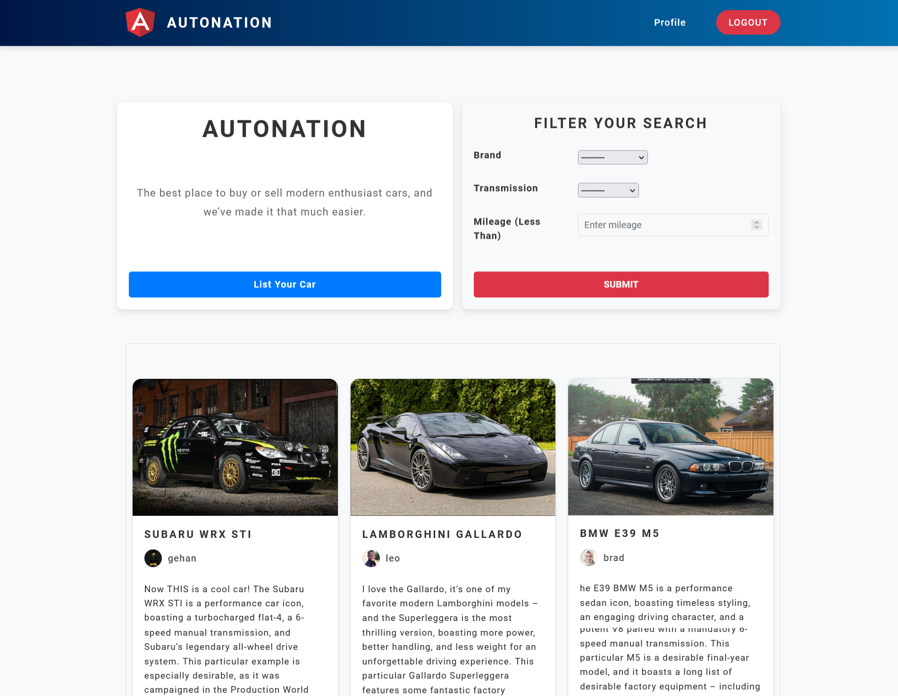
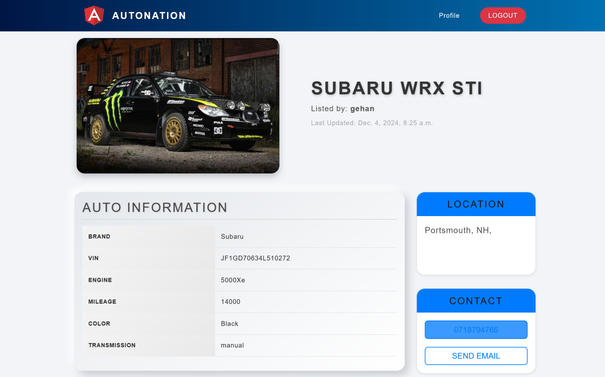

# AUTONATION

**AUTONATION** is a cutting-edge platform designed to streamline and enhance the experience of car buying, selling, and related services. It provides users with an intuitive interface to explore car listings, connect with sellers, and access various automotive services all in one place. Built with **Python** and **Django**, this project ensures a seamless, user-friendly experience for both buyers and sellers.

## Platform Interface Overview

Explore the AutoNation platform with the following screenshots showcasing its interface:
<table align="center">
  <tr>
    <td></td>
    <td></td>
  </tr>
  <tr>
    <td></td>
    <td></td>
  </tr>
</table>

## Features

- **Car Listings**: View and filter a wide range of car listings based on various criteria such as make, model, and price.
- **User Interaction**: Directly contact sellers via email through the platform for quick communication.
- **Responsive Design**: The platform adapts seamlessly across devices (desktop, tablet, and mobile), ensuring a smooth experience for all users.
- **Seller Profiles**: Sellers can create detailed profiles to showcase their car listings and provide contact information for prospective buyers.
- **Advanced Search Functionality**: Filters that allow users to find exactly what they're looking for, enhancing the search experience.

## Technologies Used

- **Backend**: Python, Django
- **Frontend**: HTML, CSS, JavaScript, Bootstrap
- **Database**: SQLite
- **Authentication**: Django’s built-in authentication system
